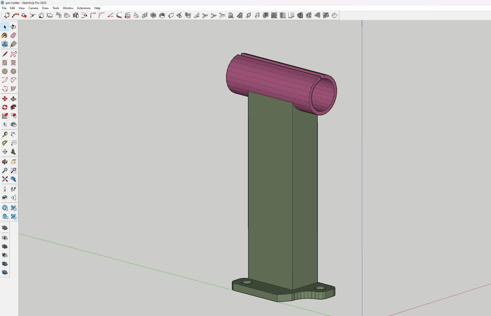
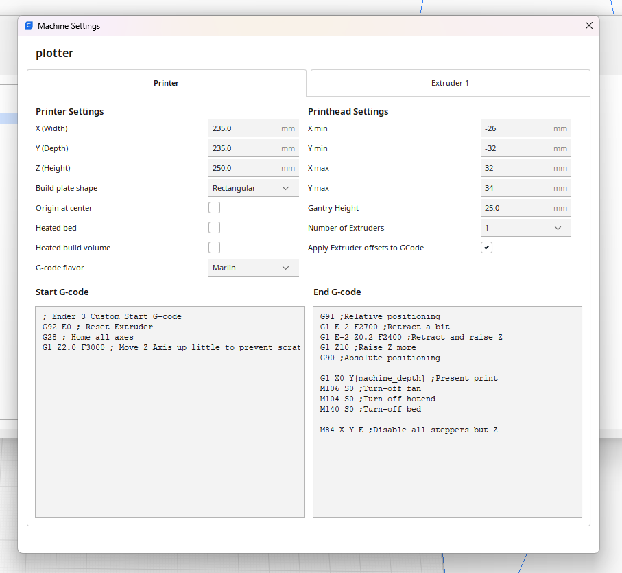
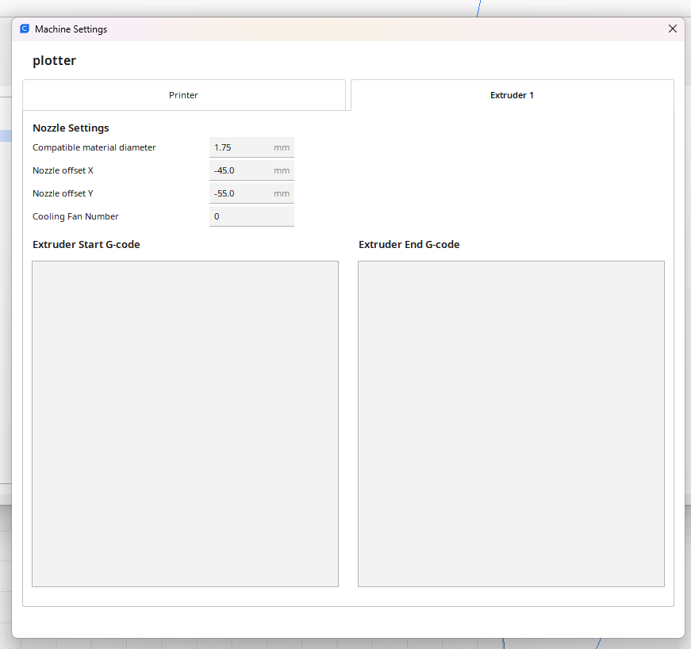
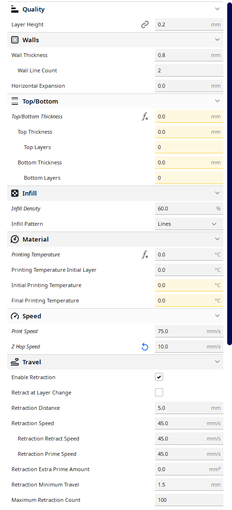
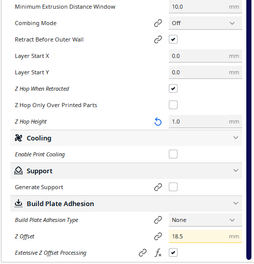
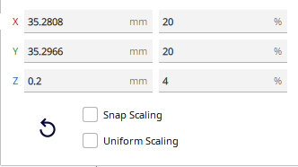
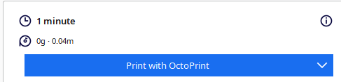

# Pen-Plotter-with-Ender-3-v2

Hi all this is my pen plotter using an ender 3 v2 and a basic pen holder.

Firstly i took a photo of the BL-TOUCH bracket: 

  

Using that i modeled a bracket in sketchup 

  

After printing it, I added 2 "O" rings as clamps to secure the pen.
This turned out better than i thought with keeping the pen secured with no movement.

# Now the fun part

Setting up cura to now print with a pen.

Firstly start with setting up a new machine using the ender 3 v2 defaults, and then go in and change a few things under the "Printer" tab.

  

Turn off Heated Bed.
Change the Start G-code to look like mine by removing a few of the initial print settings, aswell as the End G-code.
This removes the priming extrude line at the beginning and the final wipe that causes the pen to draw a short line at the end

In the "Extruder" Tab

  

Set the Nozzle offset X -45 and Y -55 mm this ensures that the pen is positioned as the "Center"

After setting up the machine:
you then want to change your print settings.

  
  

layer height 0.2mm
wall thickness 0.8 = 2 line count, as i like it doubled (im using a 0.4mm pen for this change your numbers according to your pen)
set your top/bottom thickness to 0 for a single layer print
infill to 60% or more to fill in your drawing i use the lines infill type
make sure you set your printing temp to 0 so the extruder does not turn on.
speed i set to 75 mm/s but you can experiment with numbers that you like to use.
z hop speed i set to 10 to be conservative
enable retraction
enable z hop when retracted
z hop height to 1 or more if its not lifting enough off the page
disable print cooling
disable supports
set build plate adhesion to "none"
*** install the "Z-offset" plugin in the marketplace to have access to the Z offset setting
i determined that my pen was 18.5mm away from the print nozzel so that is the number i used for "Z Offset" depending on your pen this will be different
enable "Extensive Z Offset Processing" - (if your print doesnt work disable this setting)

# Setting up your image file

Make or find an svg image of what you want to print.
Then convert it to a stl file with [SVG2STL](https://svg2stl.com/)
keeping the setting default works just fine

Then import your stl to cura, and scale it appropriatly, after which you want to then un check Uniform Scaling and set "Z" to 0.2mm

  

Make sure after you push slice there is a estimated time (if not change "Z" scale up a little till you have a estimated print time)

  

Send it to your printer and cross your fingers that nothing failed and enjoy drawing :) 

  

Thanks for having a look at my project, this is my first time posting any thing to github and i know theres no code anywhere but this is how i do, and i appreciate you all.
